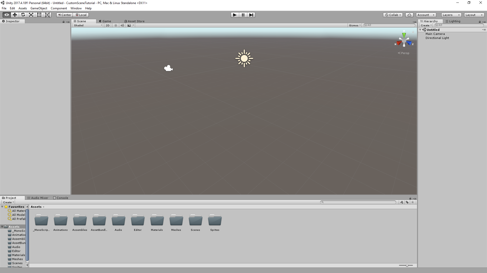
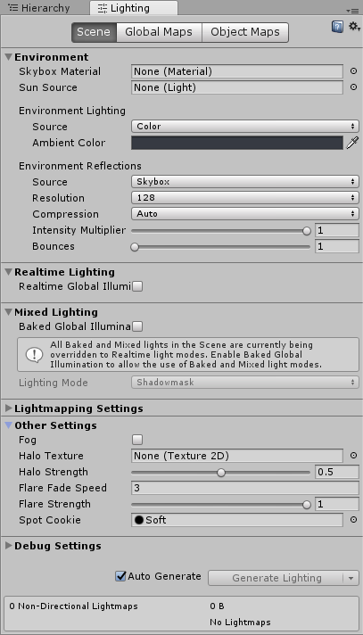

Creating custom Scenes with Unity
=================================

Introduction
^^^^^^^^^^^^
The process behind creating levels is equally diverse with the simplest methodology requiring you to create and position everything manually with code. 
This approach will have you create your levels in the game engine Unity, and import your new level back into Hollow Knight.
By the end of this tutorial, you should be able to accomplish all of these tasks with limited extra help needed.
With all of that said, this tutorial will be geared towards those who have previously modded Hollow Knight and furthermore, it will assume
you know how to assetbundle new scenes into Hollow Knight.

Background
^^^^^^^^^^
You cannot create scenes without having a good understanding of the various aspects that run Hollow Knight and its mods. 
Therefore, this guide recommends and expects that you have already worked with the following topics:

* Understanding the structure of a basic mod.
* Having basic Unity knowledge.

.. note::
    You will also need the ability to choose between reimplementing certain behaviors/object yourself or copying them using preloading.

.. note::
    With the exception of basic Unity knowledge, all other topics listed are explained, either through video or text, on this site. 
    If you still need assistance, don't be afraid to ask on Discord.

What you will need
^^^^^^^^^^^^^^^^^^
* `Unity version 2017.4.10f <https://unity3d.com/get-unity/download/archive>`_
* Modding API
* C# IDE (Visual Studio or JetBrain Rider, this guide is written with Visual Studio as an IDE)

And now, here are the steps to create custom Hollow Knight scenes. 

Mod project setup
^^^^^^^^^^^^^^^^^
1) Create a new C# class library project. Use the one labelled "Class library (.NET Framework)".

2) Give it a name and select .NET Framework 3.5

3) Add the modding api and the SFCore library mod as a reference.

.. note::
   SFCore is needed because of the MonoBehaviours we will use in the custom scene.

4) Add :code:`GetPlayerBoolHook`, :code:`LanguageGetHook` & :code:`UnityEngine.SceneManagement.SceneManager.activeSceneChanged`

5) The :code:`GetPlayerBoolHook` will only listen to a bool that we will call :code:`CustomSceneTutorial_VisitedArea` and will always return false

.. code-block:: c#

   private bool OnGetPlayerBoolHook(string target)
   {
      if (target == "CustomSceneTutorial_VisitedArea") return false;
      return PlayerData.instance.GetBoolInternal(target);
   }

6) The :code:`LanguageGetHook` will only listen to 3 strings that start with :code:`"CustomSceneTutorial_AreaTitle_"`

.. code-block:: c#

   private string OnLanguageGetHook(string key, string sheet)
   {
      if (sheet == "Titles" && key == "CustomSceneTutorial_AreaTitle_SUPER") return "Testing";
      else if (sheet == "Titles" && key == "CustomSceneTutorial_AreaTitle_MAIN") return "area";
      else if (sheet == "Titles" && key == "CustomSceneTutorial_AreaTitle_SUB") return "of doom";
      return Language.Language.GetInternal(key, sheet);
   }

7) The :code:`UnityEngine.SceneManagement.SceneManager.activeSceneChanged` will do nothing for now

.. code-block:: c#

   private void OnSceneChanged(Scene from, Scene to)
   {
   }

8) For the ease of simplicity add the preloads "Area Title Controller" & "_SceneManager" from "White_Palace_18"

.. code-block:: c#

   public override List<ValueTuple<string, string>> GetPreloadNames()
   {
      return new List<ValueTuple<string, string>>
      {
         new ValueTuple<string, string>("White_Palace_18", "Area Title Controller"),
         new ValueTuple<string, string>("White_Palace_18", "_SceneManager"),
         new ValueTuple<string, string>("White_Palace_18", "_Managers/PlayMaker Unity 2D")
      };
   }

9) This also means storing these preloaded GOs in your mod class

10) For later use in Unity, also add `a script for inserting an AreaTitleController <https://github.com/SFGrenade/TestOfTeamwork/blob/master/MonoBehaviours/Patcher/PatchAreaTitleController.cs>`_, `a script to insert a SceneManager<https://github.com/SFGrenade/TestOfTeamwork/blob/master/MonoBehaviours/Patcher/PatchSceneManager.cs>`_ and `a script to insert a PlayMaker Manager<https://github.com/SFGrenade/TestOfTeamwork/blob/master/MonoBehaviours/Patcher/PatchPlayMakerManager.cs>`_

11) Also for later use in Unity, add a script for setting the correct width and height of the scene

.. code-block:: c#

   class PatchTilemapSize : MonoBehaviour
   {
      public int width = 30;
      public int height = 17;

      public void Awake()
      {
         On.GameManager.RefreshTilemapInfo += OnGameManagerRefreshTilemapInfo;
      }

      public void OnDestroy()
      {
         On.GameManager.RefreshTilemapInfo -= OnGameManagerRefreshTilemapInfo;
      }

      private void OnGameManagerRefreshTilemapInfo(On.GameManager.orig_RefreshTilemapInfo orig, GameManager self, string targetScene)
      {
         orig(self, targetScene);
         if (targetScene == gameObject.scene.name)
         {
               self.tilemap.width = width;
               self.tilemap.height = height;
               self.sceneWidth = width;
               self.sceneHeight = height;
               FindObjectOfType<GameMap>().SetManualTilemap(0, 0, width, height);
         }
      }
   }

Preparation for Unity
^^^^^^^^^^^^^^^^^^^^^

12) Create a new C# class library project using Unity. Use the one labelled "Class library (.NET Framework)".

13) Give it a name (i suggest the same from before, but with :code:`"Scripts"` behind it) and select .NET Framework 3.5

14) Add ONLY the required unity assemblies as references

15) Copy only the MonoBehaviour classes from before into this new project

16) You can remove all functions from these classes, only the member variables are important

.. note::
   For member variables that are of enum types, you can use other enums that have the same ranges covered as seen in the PatchSceneManager class.

17) Build this MonoBehaviour-Only project and copy the DLL

Unity project setup
^^^^^^^^^^^^^^^^^^^
18) Create a new project using Unity. As a template choose the 3D template. The name is irrelevant.

19) Make a few folders for organizing assets.

   Figure 1: My personal assortment of folders to organize assets.

20) Paste the copied DLL from before into the :code:`Assemblies` folder, also add the :code:`SFCoreUnity.dll` assembly

.. note::
   Don't forget to rename :code:`SFCoreUnity.dll` to :code:`SFCore.dll`

21) Create a scene in unity

22) Change the lighting of the scene

   Figure 2: Lighting settings that are good to use

23) Add your terrain meshes, put colliders on them (either :code:`EdgeCollider2D`s or :code:`PolygonCollider2D`s) and put them on layer 8 (aka the terrain layer)

.. note::
   This can utilize custom made meshes in programs like Blender

24) On these mesh GameObjects, add the :code:`SceneMapPatcher` component from SFCore and give it a black texture to use.

25) Behind everything (with a global Z position of around 7), it is good to add a BlurPlane with a :code:`MeshFilter`, :code:`MeshRenderer` and :code:`BluePlanePatcher` component

26) Add decorations, sprites should have the :code:`SpritePatcher` component on them or above them in the hierarchy.

27) Add a GameObject called :code:`__Initializer` with a :code:`PatchAreaTitleController` :code:`PatchSceneManager`, :code:`PatchPlayMakerManager` & :code:`PatchTilemapSize` component

28) The :code:`PatchAreaTitleController` will be set as a sub area with the area event :code:`CustomSceneTutorial_AreaTitle` and the visited bool :code:`CustomSceneTutorial_VisitedArea`

29) The :code:`PatchSceneManager` can be adjusted to ones liking

30) The :code:`PatchPlayMakerManager` should be given a transform of a GameObject called :code:`_Managers`

31) The :code:`PatchTilemapSize` should be given the width & height of the custom scene

32) Add an entry & exit by adding a GameObject with a Collder set as a trigger and a :code:`TransitionPoint` component, which can be added as a simple :code:`.cs` file in the :code:`_MonoBehaviours` folder in the assets

33) Build the assetbundles and include them in the first C# project as embedded resources

34) In the mod, load the assetbundles in either the constructor or the :code:`Initialize` function

Accessing the custom scene
^^^^^^^^^^^^^^^^^^^^^^^^^^

35) in :code:`UnityEngine.SceneManagement.SceneManager.activeSceneChanged` that did nothing until now, add code to create a GameObject with a :code:`TransitionPoint` wherever you want to access your scene from

36) Build the mod

37) Enjoy your first empty custom scene!
